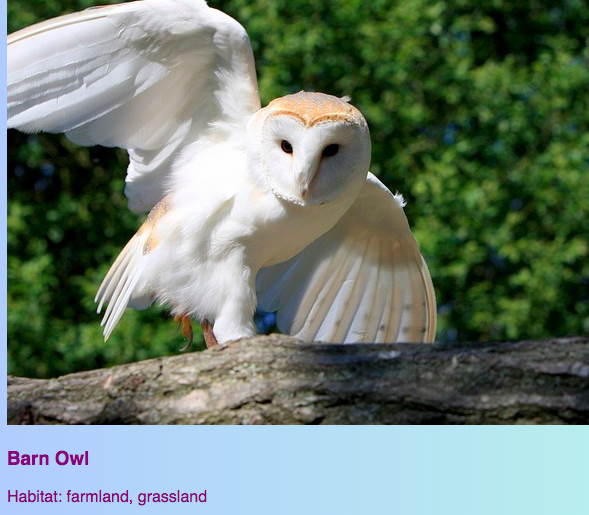
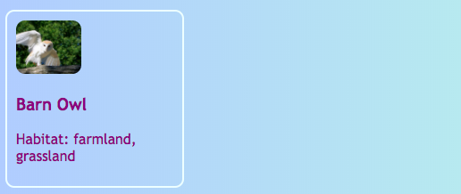

## Clickable cards

Here's a technique you could use to make a photo gallery, or a portfolio page showing off your projects: little **preview cards**.


+ Add the following HTML code to your website, anywhere you like. I'm doing mine on `index.html`. You can change the picture and text to suit your own preview cards. I'm going to do a bunch of highlights of the tourist attractions in Ireland.

```html
    <article class="card">
        
        <h3>Barn Owl</h3>
        <p>Habitat: farmland, grassland</p>
    </article>
```



+ Add the following CSS code to create the classes `card` and `tinyPicture`:

```css
    .tinyPicture {
        height: 60px;
        border-radius: 10px;
    }
    .card {
        width: 200px;
        height: 200px;
        border: 2px solid #F0FFFF;
        border-radius: 10px;
        box-sizing: border-box;
        padding: 10px;
        margin-top: 10px;
        font-family: "Trebuchet MS", sans-serif;
    }
    .card:hover {
        border-color: #1E90FF;
    }
```



Let's turn the whole preview card into a link so people can click to see more information.

+ Place the whole `article` element inside a link element. Make sure the closing `</a>` tag is after the closing `</article>` tag! Feel free to change the link **URL** to whatever you want to link to. That could be another page on your website, or it could be another website entirely.

```html
    <a href="birds.html#scBarnowl">  
        <article class="card ">
            
            <h3>Barn Owl</h3>
            <p>Habitat: farmland, grassland</p>
        </article>
    </a>
```


--- collapse ---
---
title: Linking to a specific part of a page
---

Notice how the value of `href` in my link ends in `#scBarnowl`? This is a neat trick you can use to jump to a particular part of a page.

+ First, type the URL of the page to link to, followed by `#`.

+ In the code file for the page you are linking to, find the part you want to jump to and give that element an `id`, for example, `<section id="scBarnowl"`. The value of the `id` is what you type after the `#` in your link.

--- /collapse ---

--- collapse ---
---
title: Resetting styles
---

Now that the whole preview card is a link, the text font may have changed.

+ If so, you can fix it by adding a **CSS class** to the link: `class="cardLink"`. Here's the CSS code to put in your style sheet:

```css
    .cardLink {
        color: inherit;
        text-decoration: none;
    }
```

Setting the value of any property to `inherit` makes it use the value that the **parent** element has. So in this case, the text colour will match the rest of the text on the homepage.

--- /collapse ---

+ Make at least four or five of these cards. If you are working from my example website, you could do one for each of the sections on the Protected Birds page. On the next Sushi Card, you'll learn how to arrange the cards with a cool trick!
