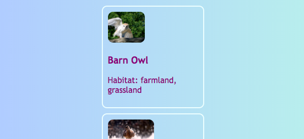
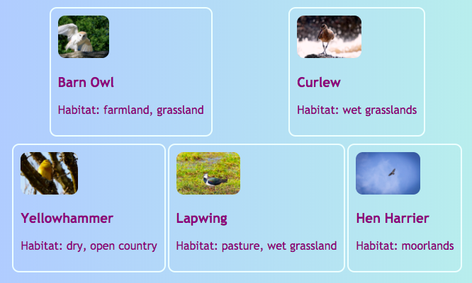
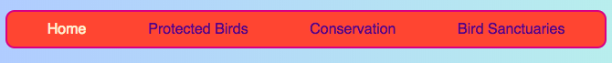

## All in a row

On this card you will learn some tricks for arranging things **horizontally** on a page. First, you'll see how to get stuff centered. Then you'll arrange elements side by side in a row. 

+ Add the following CSS properties to the `.card` class:

```css
    margin-left: auto;
    margin-right: auto;
```

You should see the cards move to the center of the page. By setting the left and right margins to `auto`, you can make any element be in the middle instead of over to the left. 



+ Drag the edge of the browser window to make the page narrower and wider — notice that the cards stay centered.

+ Put all of the card links you just made into a new container element. It's not going to be an `article` or a `section`, but one called `div`. This is a general-purpose container you can use for grouping things and making nice layouts.

```html
    <div class="cardContainer">
```

+ Add the following CSS code in your style sheet:

```css
    .cardContainer {
        display: flex;
        flex-wrap: wrap;
        justify-content: space-around;
        padding: 10px;
    }
```

Voilà! Thanks to **Flex**, your cards are now displayed side by side! 

+ Drag the edge of your window to make the website wider and narrower, and watch how the cards move around to fit the window size, sometimes wrapping to the next line.


+ Try deleting the `width` and `height` properties from the `.card` class and see what happens: `flex` cleverly fits the cards together like a jigsaw puzzle, keeping an even height across everything that's in the same row.



If you have a navigation menu at the top of your page, that's another place you can use this trick. Your menu needs to be composed of list elements( (`li`) for this next bit. If you prefer, you can try it out with my website.

+ Find the CSS rules for the menu. In my website, that's the blocks `nav ul`, `nav ul li`, and `nav ul li a`.

+ Delete the property `display: inline;` from the list items. Then, in the list `nav ul`, add in:

```css
    display: flex;
    justify-content: flex-start;
```
   


You end up with pretty much the same menu, right? The cool thing about `flex` is you can control the layout with the property `justify-content`. 

+ Change the value of `justify-content` to `flex-end` and see what happens. Or change it to `space-around` to make the menu items evenly spaced, just like you did for the cards.




**`flex`** is a pretty powerful layout tool that could fill a whole Sushi Card series of its own — you can learn more about it at [dojo.soy/se-flex](http://dojo.soy/se-flex).
