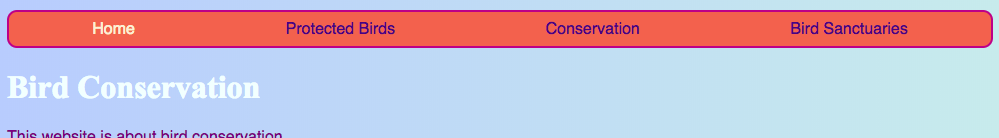
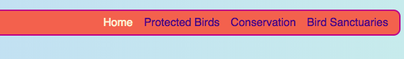

## Make your menu responsive

A **responsive** website is one that adjusts itself to the screen size so it always looks great, whether you're looking at it on a computer, mobile phone, or tablet. Let's make your menu responsive!

You'll start with the regular styles: this will be your **default** behaviour.

--- collapse ---
---
title: What does 'default' mean?
---

The default styles are your normal set of style rules. They are applied no matter what, before checking any special conditions.

You can add code that then checks the size of the screen and makes some adjustments if necessary.

--- /collapse ---

+ Add the following CSS rules to your menu. You probably have colours and borders defined as well; I've left them out to save space here! If you already have CSS rules defined for your menu, just add in or change the properties and values below that you are missing.

```css
    nav ul {
        padding: 0.5em;
        display: flex;
        flex-direction: column;
    }
    nav ul li {
        text-align: center; 
        list-style-type: none;
        margin-right: 0.5em;
        margin-left: 0.5em;
    }
```

With the CSS code above, your menu will be best suited to small screens. This is called **mobile-first** development. 


--- collapse ---
---
title: What does 'mobile-first' mean?
---

Quite often when coding a website, you will be using a computer screen, and you'll probably define your styles based on how it looks on that screen.

When you code for mobile first, you instead choose default styles that are suitable for small screens such as smartphones. You then add extra code to make adjustments for bigger screens.

Since more and more people browse the internet on their smartphones or tablets rather than on a computer, it's good practise to develop your website with this in mind.

--- /collapse ---

+ Now add the following code to your style sheet:

```css
    @media all and (min-width: 1000px) {
        nav ul {
            flex-direction: row;
            justify-content: space-around;
        }
    }
```

The first line of code above checks what size the browser window is. If the window is **1000 pixels** wide or more, it will apply all the style rules inside the block.



--- collapse ---
---
title: How does it work?
---

The block contains new values for only some properties of the `nav ul` menu. 

Whenever the window is wider than 1000 pixels, these new values will be applied instead of the ones you already defined for `nav ul`. 

The rest of the properties you defined previously for `nav ul` will stay the same.

--- /collapse ---

+ If you are using Trinket to write code, it might be helpful to download the project so you can test it out on a full-size screen.

--- challenge ---

## Challenge: make your menu adjust itself for big screens

+ Can you add another block for screens bigger than **1600 pixels**, with `flex-end` instead of `space-around`?



--- hints ---

--- hint ---

The following code defines flex properties for menu items when the screen is bigger than 1600 pixels:

```css
    @media all and (min-width: 1600px) {
        nav ul {
            flex-direction: row;
            justify-content: flex-end;
        }
    }  
```

--- /hint ---

--- /hints ---


--- /challenge ---

You can put any CSS rules you like into blocks like these to define different styles for different screen sizes. It’ll be especially useful when you do CSS grid layouts later!
