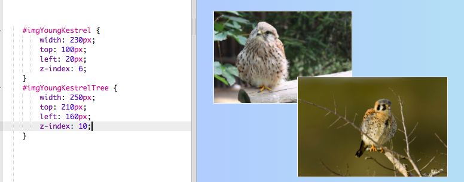

## Photo collage

On this card you will learn to use CSS to exactly position HTML elements and make a photo collage. 


+ Add a `div` to your page and put as many images in it as you like. Give the `div` and the `img` elements `id` values.

```html
    <div id="photoBox" class="relPos">
        
        
    </div>
```
   
The photos will appear one after the other on the web page, in the order they appear in your code.
   
+ In your CSS file, add the following CSS class for the elements inside the `div`: 

```css
    .absPos {
        position: absolute;
    }
```

+ Next, you need to add the property `position: relative;` to the container itself and define a size for it. This makes it so that the positions of the other elements are defined **relative to** (that is, within) the container.

```css
    .relPos {
        position: relative;
    }
    
    #photoBox {
        width: 800px;
        height: 400px;
    }
```

+ Then create a set of style rules for each of the elements using **id selectors** to set their sizes (`width` and/or `height` properties) as well as their exact positions.

To define the position of an element, there are four properties you can use: `left`, `right`, `top`, and `bottom`. They represent how far each of the edges should be from the parent's edge. Use either `top` or `bottom` for the vertical position, and either `left` or `right` for the horizontal position.


+ Choose exact positions for each of your pictures, and use any of the properties `left`, `right`, `top`, and `bottom` to define those positions in your CSS rules. For example, this code places the cat picture 100 pixels from the top and 60 pixels from the left:

```css
    #imgYoungKestrel {
        width: 230px;
        top: 100px;
        left: 20px;
    }
```

Note: The position values can also be negative! If you use a negative value, it will push the element off outside the container, over whichever edge you've specified.

### Making things overlap
You might want to have some of the pictures overlapping. But how do you choose which one goes on top?

+ Choose two images and give them positions that cause them to overlap.

+ Add an extra property, `z-index: 10;` to one of them, and then add `z-index: 6;` to the other. 

+ Take a look at the result on your webpage.


+ Now swap the `z-index` values, so that the `7` and the `10` are the other way around. Do you see any difference on your web page?



--- collapse ---
---
title: How does z-index work?
---

The `z-index` property lets you decide how two or more elements should overlap. The value can be any whole number. 

The element with the **highest** number ends up on **top** of the pile, or in other words at the very **front**. The element with the next highest number is behind that, and in front of the others, and so on, until you get to the element with the lowest number, which appears at the back behind all of the other elements.

--- /collapse ---

You can position any HTML elements in this way, not just images. For example, you could use a `p` element to add some text over a photo.

--- challenge ---

## Challenge: make a photo collage

+ Try creating your own collage of photos like the one shown below! Use exact positioning together with different `z-index` values to get the overlap effect the way you want it.

--- hints ---

--- hint ---

Below is the HTML code for the photo collage on my Ireland website. There are six photos and a piece of text all inside a `div`.

```html
    <div id="photoBox" class="relPos">
        
        
        
        
        
        <p id="photoText" class="absPos"><em>The Kestrel</em></p>
    </div>
```
   
--- /hint ---

--- hint ---

Here are the CSS rules that set the positions for each of my pictures in the collage:

```css
    #imgYoungKestrel {
        width: 230px;
        top: 100px;
        left: 20px;
        z-index: 6;
    }
    #imgYoungKestrelTree {
        width: 250px;
        top: 210px;
        left: 160px;
        z-index: 10;
    }
    #imgKestrelSky {
        width: 250px;
        top: 65px;
        left: 180px;
        z-index: 8;
    }
    #imgHello {
        width: 150px;
        top: 10px;
        left: 340px;
        z-index: 9;
    }
    #imgKestrel {
        width: 200px;
        top: 120px;
        left: 360px;
        z-index: 7;
    }
    #photoText {
        font-family: "Times New Roman", serif;
        color: #cc6699;
        font-size: 22px;
        left: 185px;
        top: 190px;
        z-index: 20;
    }
```

--- /hint ---

--- hint ---

Here are the CSS classes I've used:

```css
    .collagePhoto {
        border: 1px solid white;
    }
    .relPos {
        position: relative;
    }
    .absPos {
        position: absolute;
    }
```

--- /hint ---

--- /hints ---


--- /challenge ---

