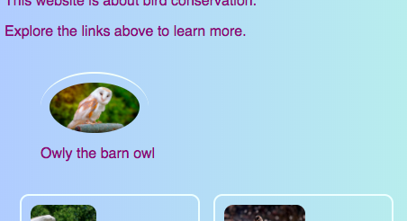
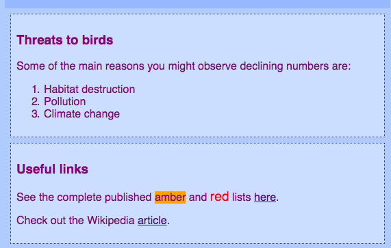

## Captions and side notes

On this card you'll learn about two more types of **container** element: one that you can use to add a caption (some text like a title or short description) to a picture, and another for when you have extra stuff that doesn't really belong with the main information on a page.

### Pictures with captions

+ Find an `img` element where you have text above or below that goes with the picture. I'm working with the Tito picture on `index.html`, but you can go with whatever is on your website.

```html
  the dog" />        
  <p>
    Owly the barn owl
  </p>
```

+ On the line above the code, add the opening tag `<figure>`. On a new line below the code, place the closing tag `</figure>`.

+ Next, remove the `p` tags, or whatever tags you have around the text (maybe it's a heading, like `h2`?), and put the text in between `<figcaption> </figcaption>` tags instead. The whole thing should look something like this:

```html
  <figure>
      the dog" />        
      <figcaption>
      Owly the barn owl
      </figcaption>
  </figure>
```

The `figcaption` element is your **caption**. It can go either above the `img` element or below it.



--- collapse ---
---
title: Why is this useful?
---

The `figure` element acts as a sort of **container** for your picture and its caption. This allows you to treat them as one unit when defining styles.

Grouping them together logically also helps to maintain good structure in your website code.

--- /collapse ---

You can use CSS code to style `figure` and `figcaption` as you would any other element using classes, IDs, or element selectors. I'm adding the following rules to remove the extra spacing that was added by the new container:

```css
  figure { 
      margin-top: 0px;
      margin-bottom: 0px;
      margin-left: 0px;
      margin-right: 0px;
  }
```

### Side notes

The Protected Birds page on my website is a list of bird species that are in decline in Ireland. I want to add some notes about common reasons for declining bird numbers, as well as some useful links. That information doesn't really belong in the `article` element with all the birds. This is an example of when you might use the `aside` element.

+ Go to a page of your website that has an `article` element on it — I'm using `birds.html`.

+ **Outside** of the `article` element, add one or more pairs of `<aside> </aside>` tags containing your extra stuff.

```html  
  <aside class="sideNoteStyle">
      <h3>Threats to birds</h3>
      <p>
        Some of the main reasons for declining numbers of birds are:
      </p>
      <ol>
        <li>Habitat destruction</li>
        <li>Pollution</li>
        <li>Climate change</li>
      </ol>
    </aside>
    <aside class="sideNoteStyle">
      <h3>Useful links</h3>
      <p>See the complete published <span class="warnOrange">amber</span> and <span class="warnRed">red</span> lists
      <a href="https://www.birdwatchireland.ie/LinkClick.aspx?fileticket=VcYOTGOjNbA%3d&tabid=178">here</a>.</p>

      <p>Check out the Wikipedia <a href="https://en.wikipedia.org/wiki/Bird_conservation">article</a>.</p>
    </aside>
```

--- collapse ---
---
title: Why is this useful?
---

The `aside`, `article`, and other containers are all similar. The only real difference is in the **meaning**, that is, what you use them for.

It's important to use meaningful HTML elements whenever you can. It gives your website better structure and is especially helpful for people using **screen readers**.

--- /collapse ---

Did you spot the other element in there, `span`? This is a special tag you can use just for adding extra CSS code! You can put anything in between a pair of `span` tags. It's useful for things like styling a **part** of the text in a paragraph.

+ Add the following CSS code to your style sheet to complete the styling for the HTML code above.

```css
  .sideNoteStyle {
    border: dotted 1px purple;
    background-color: #cddffe;
    padding: 0.5em;
    margin: 0.5em;
  }
  .warnOrange {
    background-color: #ffa500;
  }
  .warnRed {
    color: #FF4500;
    font-size: larger;
  }

```



On the next card, you're going to learn how to make your website's layout more interesting!

+ To get ready, make a page that has one `article` and two `aside` elements inside the `<main> </main>` tags. Or if you prefer, you can work with the Protected Birds page on my website.

   
