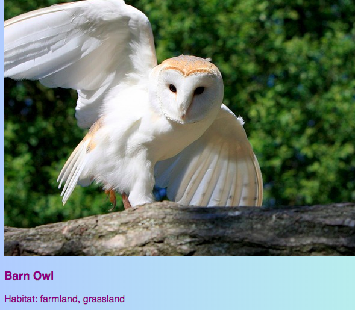

## क्लिक करने योग्य कार्ड

यहां एक तकनीक है जिसका उपयोग करके आप फोटो गैलरी या अपने प्रोजेक्ट्स (projects) दिखाने वाले एक पोर्टफोलियो पेज (portfolio page) बनाने के लिए कर सकते हैं: little **preview cards**.


+ अपनी पसंद के अनुसार, अपनी वेबसाइट में निम्न HTML कोड जोड़ें। मैं `index.html` पर अपना काम कर रहा हूँ । आप अपने प्रीव्यू कार्ड (preview card) के अनुरूप चित्र व शब्दों (picture & text) को बदल सकते हैं। मैं आयरलैंड (Ireland) में पर्यटकों को भाने वाले कुछ जगहों को चिन्हित करने वाला हूँ।

```html
    <article class="card">
        
        <h3>Barn Owl</h3>
        <p>Habitat: farmland, grassland</p>
    </article>
```



+ `card` और `tinyPicture` क्लासेज(Classes) बनाने के लिए निम्न CSS कोड जोड़ें:

```css
    .tinyPicture {
        height: 60px;
        border-radius: 10px;
    }
    .card {
        width: 200px;
        height: 200px;
        border: 2px solid #F0FFFF;
        border-radius: 10px;
        box-sizing: border-box;
        padding: 10px;
        margin-top: 10px;
        font-family: "Trebuchet MS", sans-serif;
    }
    .card:hover {
        border-color: #1E90FF;
    }
```


चलिए पूरे प्रीव्यू कार्ड (preview card) को लिंक में बदलते हैं ताकि लोग अधिक जानकारी देखने के लिए क्लिक कर सकें।

+ पूरे `article` element को एक link element के अंदर रखें। इस बात का ध्यान रखे की `</a>` tag, (आर्टिकल टैग) `</article>` tag के बाद बंद किया जाए! **URL** लिंक को आप अपने अनुसार बदल सकते हैं। यह आपकी वेबसाइट पर अन्य पेज हो सकता है, या या कोई दूसरी वेबसाइट भी हो सकती है।

```html
    <a href="birds.html#scBarnowl">  
        <article class="card ">
            
            <h3>Barn Owl</h3>
            <p>Habitat: farmland, grassland</p>
        </article>
    </a>
```


--- collapse ---
---
title: किसी पेज (page) के विशिष्ट(specific) भाग के लिंक
---

ध्यान दें कि कैसे `href` का मान(value) मेरे लिंक में `#scBarnowl` से समाप्त हो रहा है? यह एक अच्छी चाल है जिसका उपयोग करके आप किसी भी पेज (page) के किसी विशेष भाग में जा सकते हैं।

+ सबसे पहले, लिंक करने के लिए पेज का URL टाइप करें, उसके बाद `#` ।

+ जिस पेज को आप लिंक कर रहे हैं, उसके लिए कोड फ़ाइल में, उस भाग को ढूंढें जिसे आप लिंक करना चाहते हैं और उस element को आईडी दें `id`, उदाहरण के लिए, `<section id="scBarnowl">`। `id` आईडी का मान = आप अपने लिंक में `#` के बाद लिखते हैं।

--- /collapse ---

--- collapse ---
---
title: Resetting styles (शैलियों को रीसेट करना)
---

अब जबकि पूरा प्रीव्यू कार्ड (preview card) लिंक है, तो टेक्स्ट फॉण्ट (text font) बदल सकता है।

+ यदि हां, तो आप इसे **CSS class** लिंक में जोड़कर ठीक कर सकते हैं: `class="cardLink"` । अपनी स्टाइल शीट (style sheet) में डालने के लिए यहां CSS कोड दिया गया है:

```css
    .cardLink {
        color: inherit;
        text-decoration: none;
    }
```

किसी भी प्रॉपर्टी (property) के मान(value) को `inherit` निर्धारित करने से वह अपने **parent** element के मान(value) का उपयोग करता है। तो इस मामले में, टेक्स्ट (text) का रंग होमपेज (homepage) के बाकी टेक्स्ट से मेल खाएगा।

--- /collapse ---

+ ऐसे कम से कम चार या पांच कार्ड बनाएं। यदि आप मेरी उदाहरण वेबसाइट से काम कर रहे हैं, तो आप संरक्षित पक्षी पृष्ठ (Protected Birds page) पर प्रत्येक अनुभाग के लिए एक कर सकते हैं। अगले सुशी कार्ड (Sushi card) में आप सीखेंगे कि कार्ड को अच्छी चाल से कैसे व्यवस्थित किया जाए!
