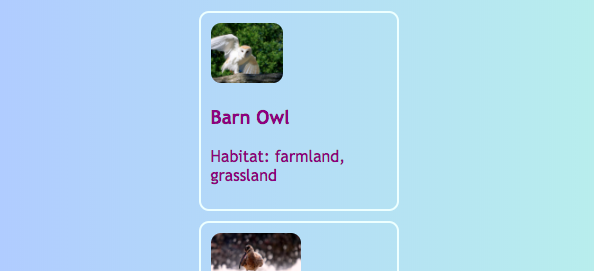
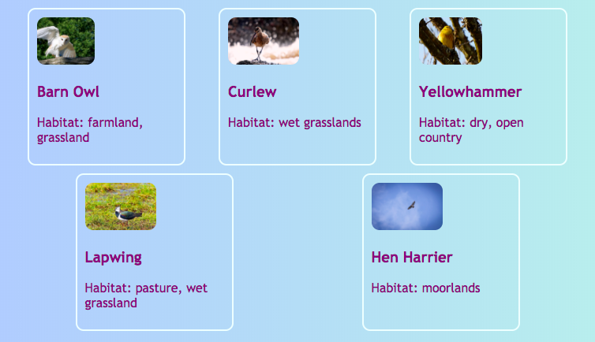
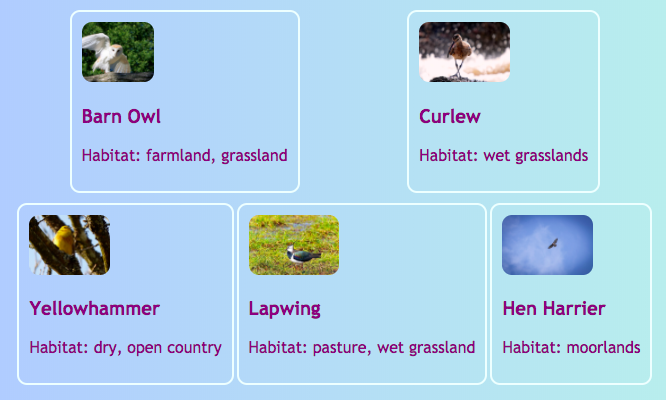
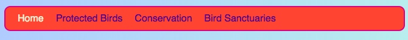
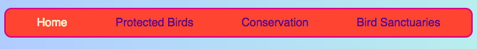
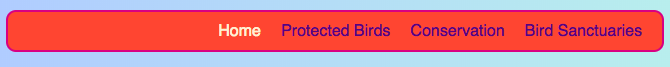

## सभी एक पंक्ति में

इस कार्ड पर आप एक पेज (page) पर चीजों को **क्षैतिज (horizontally)** व्यवस्थित करने के लिए कुछ तरकीब सीखेंगे । सबसे पहले, आप देखेंगे कि सामान को कैसे केंद्रित किया जाए। फिर आप एक पंक्ति में तत्त्वों (elements) को एक तरफ से व्यवस्थित करेंगे।

+ `.card` क्लॉस (class) में नि्नलिखित CSS प्रॉपर्टीज (properties) जोड़ें:

```css
    margin-left: auto;
    margin-right: auto;
```

आपको कार्ड पेज के बीच में जाते हुए दिखेंगे। बाएँ और दाएँ किनारे (margins) को `auto` सेट करके, किसी भी तत्व (element) को बाईं ओर के बजाय बीच में रख सकते हैं।



+ पेज (Page) को संकीर्ण(narrower) और व्यापक(wider) बनाने के लिए ब्राउज़ विंडो (browser window) के किनारे को खींचें - ध्यान दें कि कार्ड केंद्रित रहेगा।

+ कार्ड के सभी लिंक (link) आप एक नए कंटेनर तत्व (container element) में डाल दें। यह एक `article` या `section` नहीं, लेकिन एक `div` है। यह एक सामान्य-उद्देश्य वाला कंटेनर (general-purpose container) है जिसे आप चीजों को समूहीकृत करने और अच्छे लेआउट (layout) बनाने के लिए उपयोग कर सकते हैं।

```html
    <div class="cardContainer">
```

+ अपनी स्टाइल शीट (style sheet) में निम्नलिखित सीएसएस कोड (CSS Code) जोड़ें:

```css
    .cardContainer {
        display: flex;
        flex-wrap: wrap;
        justify-content: space-around;
        padding: 10px;
    }
```

देखा! **Flex** की मदद से आपके कार्ड अब अगल-बगल प्रदर्शित हो रहे हैं!

+ वेबसाइट को व्यापक (wider) और संकीर्ण (narrower) बनाने के लिए अपनी विंडो के किनारे को खींचें, और देखें कि विंडो के आकार को फिट करने के लिए कार्ड कैसे घूमते हैं, कभी-कभी अगली पंक्ति में जाते हुए।



+ `width` और `height` properties हटाने का प्रयास करें `.card` class से, देखें कि क्या होता है: `flex` चतुराई से एक पहेली की तरह एक साथ कार्ड फिट बैठता है, एक ही पंक्ति में कि समान ऊंचाई भी बरकरार रखते हुए।



यदि आपके पास अपने पेज (page) के शीर्ष पर एक नेविगेशन मेन्यू (navigation menu) है, तो भी आप इस चाल (trick) का उपयोग कर सकते हैं। आपका मेन्यू सूची तत्वों (list elements) (`li`) से बना होना चाहिए अगले हिस्से के लिए । यदि आप चाहें, तो आप इसे मेरी वेबसाइट के साथ आज़मा सकते हैं।

+ मेन्यू के लिए CSS नियम खोजें। मेरी वेबसाइट में, वह ब्लॉक `nav ul`, `nav ul li`, और `nav ul li a` हैं।

+ सूची आइटम (list items) से `display: inline;` प्रॉपर्टी (property) हटाएं। फिर, `nav ul` की सूची में, जोड़ें:

```css
    display: flex;
    justify-content: flex-start;
```



आपका मेन्यू (menu) फिर वैसा ही हो गया ना? `flex` फ्लेक्स के बारे में अच्छी बात यह है की आप लेआउट को property `justify-content` के साथ नियंत्रित कर सकते हैं।

+ `justify-content` का मान (value) को बदलें `flex-end` से और देखें क्या होता है। या इसे `space-around` से बदलें, मेन्यू आइटम को समान रूप से बनाने के लिए, जैसे आपने कार्ड्स के लिए किया था।





**`flex`** एक बहुत शक्तिशाली लेआउट उपकरण है जो अपने स्वयं के पूरे सुशी कार्ड श्रृंखला (Sushi Card series) को भर सकता है --- आप इसके बारे में अधिक जान सकते हैं यहाँ [dojo.soy/se-flex](http://dojo.soy/se-flex)।
