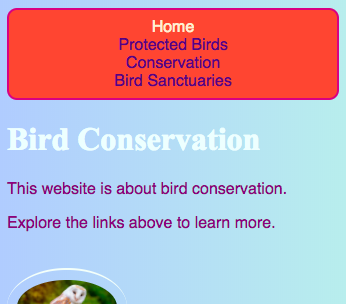
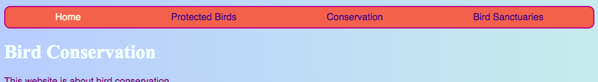
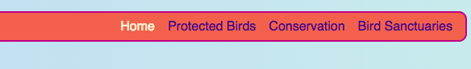

## अपने मेनू को उत्तरदायी बनाएं

एक **responsive** वेबसाइट वह है जो स्वयं को स्क्रीन के आकार अनुसार समायोजित करे, इसलिए यह हमेशा बहुत अच्छा दीखता है, चाहे आप इसे कंप्यूटर, मोबाइल फोन या टैबलेट पर देख रहे हों। चलो अपने मेनू को उत्तरदायी बनाते हैं!

आप नियमित शैलियों (regular style) से शुरुआत करेंगे: यह आपका **default** व्यवहार होगा।

--- collapse ---
---
title: 'डिफ़ॉल्ट' (default) का क्या अर्थ है?
---

डिफ़ॉल्ट शैली (Default style) आपकी शैली नियमों का एक सामान्य सेट है। उन्हें लागू किया जाता है चाहे कोई भी हो, किसी भी विशेष परिस्थितियों की जांच करने से पहले।

आप उस कोड को जोड़ सकते हैं जो तब स्क्रीन के आकार की जांच करता है और यदि जरूरत हो तो कुछ समायोजन करता है।

--- /collapse ---

+ अपने मेन्यू में निम्नलिखित CSS नियम जोड़ें। आपके पास संभवतः रंग और सीमाएँ(borders) भी परिभाषित हैं; मैंने उन्हें यहाँ जगह बचाने के लिए छोड़ दिया है! यदि आपके पास पहले से ही अपने मेन्यू के लिए CSS नियम परिभाषित हैं, तो बस नीचे दिए गए properties और values के साथ लिख दें।

```css
    nav ul {
        padding: 0.5em;
        display: flex;
        flex-direction: column;
    }
    nav ul li {
        text-align: center; 
        list-style-type: none;
        margin-right: 0.5em;
        margin-left: 0.5em;
    }
```

ऊपर के CSS कोड के साथ, आपका मेनू छोटे स्क्रीन के लिए सबसे उपयुक्त होगा। इसे **मोबाइल-प्रथम (mobile-first)** विकास कहा जाता है।



--- collapse ---
---
title: 'मोबाइल-प्रथम' (Mobile-first) का क्या अर्थ है?
---

अक्सर एक वेबसाइट को कोड करते समय, आप एक कंप्यूटर स्क्रीन का उपयोग कर रहे होंगे, और संभावना है कि आप अपनी शैलियों (style) को इस आधार पर परिभाषित करेंगे कि यह उस स्क्रीन पर कैसा दिखता है।

जब आप पहले मोबाइल के लिए कोड करते हैं, तो आप उन डिफ़ॉल्ट शैलियों (default styles) का चयन करते हैं जो स्मार्टफ़ोन (smartphone) जैसे छोटे स्क्रीन के लिए उपयुक्त हैं। फिर आप बड़ी स्क्रीन के लिए समायोजन करने के लिए अतिरिक्त कोड जोड़ते हैं।

चूंकि अधिक से अधिक लोग कंप्यूटर के बजाय अपने स्मार्टफोन या टैबलेट पर इंटरनेट चलाते हैं, इसलिए आपकी वेबसाइट को इसे ध्यान में रखते हुए विकसित करना अच्छा है।

--- /collapse ---

+ अब अपनी स्टाइल शीट (style sheet) में निम्न कोड जोड़ें:

```css
    @media all and (min-width: 1000px) {
        nav ul {
            flex-direction: row;
            justify-content: space-around;
        }
    }
```

उपरोक्त कोड की पहली पंक्ति यह जांचती है कि ब्राउज़र विंडो (browser window) किस आकार का है। यदि विंडो **1000 pixels**या अधिक चौड़ी है, तब इस ब्लॉक के अंदर की सभी शैली नियम (style rules) लागु हो जाएंगे।



--- collapse ---
---
title: यह कैसे काम करता है?
---

ब्लॉक में `nav ul` के केवल कुछ प्रॉपर्टीज (properties) के लिए नए मान (values) शामिल हैं।

जब भी विंडो 1000 पिक्सेल (pixel) से अधिक चौड़ी होती है, ये नए मान (values) लागु किए जाएंगे, उनकी जगह जो आपने पहले `nav ul` में परिभाषित किए थे।

बाकी प्रॉपर्टीज (properties) जिन्हें आपने पहले `nav ul` के लिए परिभाषित किया था वह वैसी ही रहेंगी।

--- /collapse ---

+ यदि आप कोड लिखने के लिए Trinket का उपयोग कर रहे हैं, तो यह प्रोजेक्ट (Project) को डाउनलोड करना सहायक हो सकता है ताकि आप इसे पूर्ण-आकार की स्क्रीन पर चला के देख सकें।

--- challenge ---

## चुनौती: मेन्यू बड़ी स्क्रीन के लिए खुद को समायोजित करे

+ क्या आप **1600 पिक्सेल (pixels)**, से बड़ी स्क्रीन के लिए एक और खंड जोड़ सकते हैं `space-around` के बजाय `flex-end` के साथ?



--- hints ---

--- hint ---

निम्नलिखित कोड मेन्यू आइटम के लिए फ्लेक्स गुणों (flex properties) को परिभाषित करता है जब स्क्रीन 1600 पिक्सेल (pixel) से बड़ा हो:

```css
    @media all and (min-width: 1600px) {
        nav ul {
            flex-direction: row;
            justify-content: flex-end;
        }
    }  
```

--- /hint ---

--- /hints ---


--- /challenge ---

आप अलग-अलग स्क्रीन आकारों के लिए अलग-अलग शैलियों (styles) को परिभाषित करने के लिए किसी भी CSS नियमों (CSS rules) को इन जैसे खंड में डाल सकते हैं। जब आप बाद में CSS ग्रिड लेआउट (CSS grid layout) को करेंगे तो यह विशेष रूप से उपयोगी होगा!
