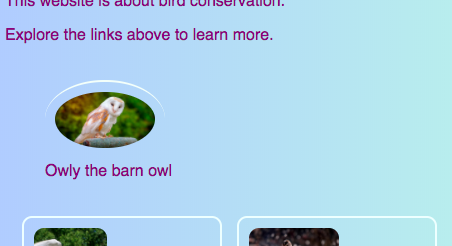
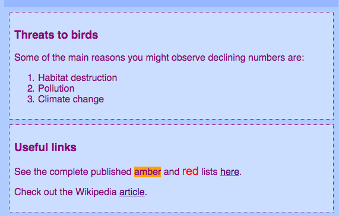

## अनुशीर्षक (Caption) और साइड नोट्स (Side Notes)

इस कार्ड पर आप दो और प्रकार के **container** element के बारे में जानेंगे: एक जिससे आप किसी तस्वीर में अनुशीर्षक (caption) (कुछ टेक्स्ट या शीर्षक या संक्षिप्त विवरण) जोड़ने के लिए उपयोग कर सकते हैं, और दूसरा, जब आपके पास कोई अतिरिक्त सामान होता है जो एक पेज (page) पर मुख्य जानकारी के साथ नहीं होना चाहिए।

### अनुशीर्षक के साथ चित्र

+ एक `img` तत्व (element) ढूंढें, जहां आपके पास ऊपर या नीचे टेक्स्ट (text) है जो चित्र (picture) के साथ होना चाहिए। मैं `index.html` में Tito picture पर काम कर रहा हूँ, लेकिन आप अपनी वेबसाइट पर जो कुछ भी है उसके साथ कर सकते हैं।

```html
  the dog" />        
  <p>
    Owly the barn owl
  </p>
```

+ कोड के ऊपर की रेखा पर, शुरू करने वाला टैग (opening tag) `<figure>` जोड़ें। कोड के नीचे एक नई लाइन पर, ख़तम करने वाला टैग (closing tag) `</figure>` जोड़ें।

+ अगला, `p` टैग, या आपके (text) के आसपास जो भी टैग हैं (शायद यह एक शीर्षक हो, जैसे `h2`) को हटाएँ, और टेक्स्ट (text) को `<figcaption> </figcaption>` के बीच में रखें। आपका कोड कुछ इस तरह दिखना चाहिए:

```html
  <figure>
      the dog" />        
      <figcaption>
      Owly the barn owl
      </figcaption>
  </figure>
```

`figcaption` तत्व (element) आपका **अनुशीर्षक (caption)** है । यह `img` तत्व (element) के ऊपर या नीचे भी लिखा जा सकता है।



--- collapse ---
---
title: यह उपयोगी क्यों है?
---

`figure` तत्व (element) आपकी तस्वीर और उसके अनुशीर्षक (caption) के लिए एक प्रकार के **container** के रूप में कार्य करता है। यह आपको शैलियों (styles) को परिभाषित करते समय उन्हें एक इकाई (one unit) के रूप में मानने की अनुमति देता है।

उन्हें तार्किक रूप से एक साथ समूहित करने से आपके वेबसाइट कोड में अच्छी संरचना को बनाए रखने में मदद मिलती है।

--- /collapse ---

आप CSS कोड का उपयोग कर `figure` और `figcaption` को शैली (style) करने के लिए कर सकते हैं जैसा कि आप किसी अन्य तत्व के लिए करेंगे, classes, IDs, या element selectors का उपयोग करते हुए। नए कंटेनर द्वारा जोड़े गए अतिरिक्त जगह (extra spacing) को हटाने के लिए मैं निम्नलिखित नियम जोड़ रहा हूं:

```css
  figure { 
      margin-top: 0px;
      margin-bottom: 0px;
      margin-left: 0px;
      margin-right: 0px;
  }
```

### साइड नोट्स (Side Notes)

मेरी वेबसाइट पर संरक्षित पक्षी पृष्ठ (Protected Birds page) है जिसमे आयरलैंड (Ireland) की उन पक्षी प्रजातिओ के नाम हैं जिनकी संख्या गिर रही है। मैं पक्षी संख्या में गिरावट के सामान्य कारणों के साथ-साथ कुछ उपयोगी लिंक के बारे में कुछ नोट्स जोड़ना चाहता हूं। वह जानकारी सभी पक्षियों की जानकारी के साथ `article` element में नहीं होना चाहिए। यह एक उदाहरण है जब आप `aside` तत्व (element) का उपयोग कर सकते है|

+ अपनी वेबसाइट के उस पेज (page) पर जाएं, जिसमें `article` element है । मैं `birds.html` का उपयोग कर रहा हूं।

+ `article` तत्व (element) के **बाहर (outside)**, एक या अधिक जोड़े लगाएं, `<aside> </aside>` टैग के, अपने अतिरिक्त टेक्स्ट के लिए।

```html  
  <aside class="sideNoteStyle">
      <h3>Threats to birds</h3>
      <p>
        Some of the main reasons for declining numbers of birds are:
      </p>
      <ol>
        <li>Habitat destruction</li>
        <li>Pollution</li>
        <li>Climate change</li>
      </ol>
    </aside>
    <aside class="sideNoteStyle">
      <h3>Useful links</h3>
      <p>See the complete published <span class="warnOrange">amber</span> and <span class="warnRed">red</span> lists
      <a href="https://www.birdwatchireland.ie/LinkClick.aspx?fileticket=VcYOTGOjNbA%3d&tabid=178">here</a>.</p>

      <p>Check out the Wikipedia <a href="https://en.wikipedia.org/wiki/Bird_conservation">article</a>.</p>
    </aside>
```

--- collapse ---
---
title: यह उपयोगी क्यों है?
---

`aside`, `article`, और अन्य कंटेनर (containet) सभी समान हैं। वास्तविक अंतर **meaning** केवल यह है कि आप उनक क्या उपयोग करते हैं।

जब भी आप कर सकते हैं सार्थक HTML तत्वों (html elements) का उपयोग करना महत्वपूर्ण है। यह आपकी वेबसाइट को बेहतर संरचना देता है और विशेष रूप से **screen readers** का उपयोग करने वाले लोगों के लिए उपयोगी है ।

--- /collapse ---

क्या आपने अन्य तत्व (element) को देखा, `span`? यह एक विशेष टैग है जिसे आप अतिरिक्त CSS कोड जोड़ने के लिए उपयोग कर सकते हैं! आप `span` टैग की एक जोड़ी के बीच में कुछ भी रख सकते हैं। यह किसी अनुच्छेद के **part** को शैलीकृत करने (styling) जैसे कामो में उपयोगी होता है।

+ ऊपर दिए गए HTML कोड की स्टाइल को पूरा करने के लिए अपनी स्टाइल शीट(style sheet) में निम्नलिखित CSS कोड जोड़ें।

```css
  .sideNoteStyle {
    border: dotted 1px purple;
    background-color: #cddffe;
    padding: 0.5em;
    margin: 0.5em;
  }
  .warnOrange {
    background-color: #ffa500;
  }
  .warnRed {
    color: #FF4500;
    font-size: larger;
  }

```



अगले कार्ड पर, आप अपनी वेबसाइट के लेआउट (layout) को और अधिक रोचक बनाने का तरीका जानने जा रहे हैं!

+ तैयार होने के लिए, एक पेज (page) बनाएं जिसमें एक `article` और दो `aside` तत्व (elements) `<main> </main>` टैग्स (tags) के अंदर हों। या यदि आप चाहें, तो आप मेरी वेबसाइट पर Protected Birds पेज (page) के साथ काम कर सकते हैं।

   
