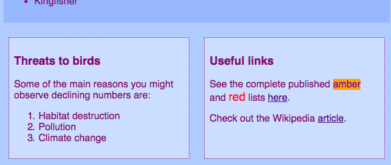
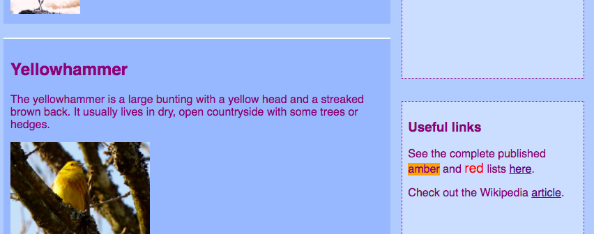
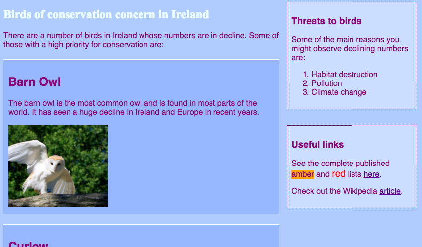

## आकर्षक पेज लेआउट (Page Layout) बनाए

+ इस कार्ड के लिए आपको एक ऐसे पेज (page) के साथ काम करना चाहिए जिसमें `main` तत्व (element) के अंदर यह तीन तत्व हों: एक `article` और दो `aside`। आगे बढ़ो और अगर आप को जरूरत है तो ये पहले बनाएं। यदि आप मेरी वेबसाइट पर काम करना चाहते हैं, तो `aside` कोड पिछले सुशी कार्ड (Susdhi card) से संरक्षित पक्षी पेज (Protected Birds page) पर जोड़ दें।

यहां तीन अलग-अलग पेज लेआउट (Page layouts) हैं जिन्हें आप लागू कर रहे हैं:


+ `main` और उसके तीनो तत्वों में यह CSS classes जोड़ें.

```html
    <main class="myPageLayoutGrid">
        <article class="myGridArticle">
            <!--other stuff here-->
        </article>
        <aside class="myGridAside1">
            <!--other stuff here-->
        </aside>
        <aside class="myGridAside2">
            <!--other stuff here-->
        </aside>
    </main>
```

आप जिस कंटेनर के लेआउट (layout) को बदलेंगे वह `main` है, लेकिन आप इसे किसी भी प्रकार के कंटेनर के साथ कर सकते हैं, जैसे `div` या `article`, या यहां तक कि पूरे page `body` के साथ भी। जिस तकनीक का आप उपयोग करने जा रहे हैं उसे **CSS grid** कहा जाता है।

इस उदाहरण में, `header` और `footer` डिजाइन से बाहर छोड़ दिया जाएगा, लेकिन उन्हें ग्रिड में भी शामिल किया जा सकता है।

+ इस कंटेनर में `display` प्रॉपर्टी (display property) को `grid` पर सेट करें:

```css
    .myPageLayoutGrid {
        display: grid;
        grid-column-gap: 0.5em;
        grid-row-gap: 1em;
    }
```

आपको क्या लगता है `grid-column-gap` और `grid-row-gap` properties क्या करते हैं?

+ अब आप एक `grid-area` बनाएँगे हर तत्व (element) के लिए:

```css
    .myGridArticle {
        grid-area: egArticle;
    }
    .myGridAside1 {
        grid-area: egAside1;
    }
    .myGridAside2 {
        grid-area: egAside2;
    }
```

अब आप अपना लेआउट (layout) डिजाइन करेंगे! दोनों `aside` तत्वों (elements) को एक दूसरे के अगल बगल रख दें पेज (page) के निचले भाग में। इसके लिए आपको दो समान चौड़ाई के **columns** (कलुमंस) की जरूरत पड़ेगी। आप **row** की ऊंचाई (height) को स्वचालित रख सकते हैं।

+ निम्नलिखित कोड को `.myPageLayoutGrid` के CSS नियमों (CSS rules) में डालें:

```css
    grid-template-rows: auto;
    grid-template-columns: 1fr 1fr;
    grid-template-areas: 
        "egArticle egArticle"
        "egAside1 egAside2";
```

`fr` का मतलब **fraction** (भाग) ही है। ध्यान रखें कि आप `article` ऐसे बनाएं की वह दोनों कलुमंस (columns) की सभी जगह का इस्तेमाल करे।


--- collapse ---
---
title: मदद! मुझे चूक व चेतावनी मिली!
---

यदि आप Trinket का उपयोग कर रहे हैं, तो आप कुछ चूक और चेतावनियों दिख सकती हैं, भले ही आपने कोड वैसे ही लिखें जैसे ऊपर लिखा है। ऐसा इसलिए है क्योंकि ट्रिंकेट(trinket) अभी तक CSS grid की प्रॉपर्टीज (properties) को नहीं पहचानता है। हालांकि, कोड अभी भी काम करेगा।

यदि CSS grid कोड आपको 'unknown property' (अज्ञात गुण) की चेतावनी देता है या 'unexpected token 1fr' (अप्रत्याशित टोकन 1fr) जैसी कोई चूक देता है, तो आप इन पर ध्यान न दें।

--- /collapse ---



अब `aside` तत्व (element) को दायीं तरफ रख दें व उन्हें `article` की आधी चौड़ाई में बनाएं।

+ `grid-template-columns` व `grid-template-areas` का मान (value) निम्नलिखित कोड से बदलें:

```css
    grid-template-columns: 2fr 1fr;
    grid-template-areas: 
        "egArticle egAside1"
        "egArticle egAside2";
```



+ यदि आप नहीं चाहते हैं कि `aside` तत्व (element) नीचे तक फैले, तो आप एक डॉट (dot) का उपयोग करके एक खाली स्थान जोड़ सकते हैं:

```css
    grid-template-areas: 
        "egArticle egAside1"
        "egArticle egAside2"
        "egArticle . ";
```



--- challenge ---

## चुनौती: विभिन्न आकार के स्क्रीनों के लिए अलग-अलग लेआउट (layout) बनाएं

+ क्या आप स्क्रीन आकार जांच का उपयोग कर सकते हैं जो आपने पहले जोड़ा था, ताकि वह, स्क्रीन कितनी चौड़ी है, उस आधार पर लेआउट (layout) में बदलाव कर सके? नोट: यदि आपने प्रत्येक स्क्रीन साइज के लिए पहले से ही CSS खंड (CSS blocks) बनाए लिए हैं, तो आप नए खंड बनाने के बजाय उन खंड में नया CSS कोड जोड़ सकते हैं।

--- hints ---

--- hint ---

निम्न कोड ऊपर वाले CSS class के लिए एक लेआउट (layout) को परिभाषित करता है, जब स्क्रीन 1000 पिक्सेल (pixel) से बड़ा हो:

```css
    @media all and (min-width: 1000px) {
        .myPageLayoutGrid {
            grid-template-columns: 1fr 1fr;
            grid-template-areas: 
                "egArticle egArticle"
                "egAside1 egAside2";
        }
    }  
```

--- /hint ---

--- hint ---

निम्न कोड ऊपर वाले CSS class के लिए एक लेआउट (layout) को परिभाषित करता है, जब स्क्रीन 1600 पिक्सेल (pixel) से बड़ा हो:

```css
    @media all and (min-width: 1600px) {
        .myPageLayoutGrid {
            grid-template-columns: 1fr 1fr;
            grid-template-areas: 
                "egArticle egAside1"
                "egArticle egAside2"
                "egArticle .";
        }
    }  
```

--- /hint ---

--- /hints ---

--- /challenge ---

**CSS grid**, आप अपनी पसंद का लगभग कोई भी लेआउट (layout) बना सकते हैं। यदि आप और अधिक सीखना चाहते हैं, तो [dojo.soy/se-css-grid](http://dojo.soy/se-css-grid){:target= "_ blank"} पर जाएँ।
