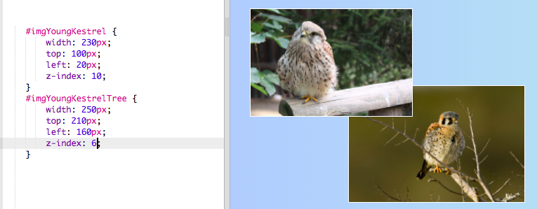
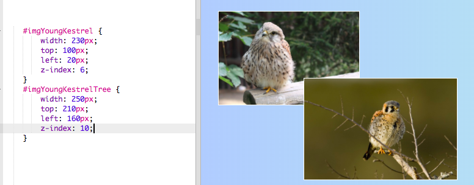
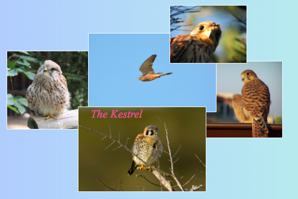

## चित्र कोल्लाज (Photo collage)

इस कार्ड पर आप CSS का उपयोग करके HTML तत्वों (HTML elements) के स्थान को ठीक करने और चित्र कोल्लाज (Photo collage) बनाना सीखेंगे।


+ अपने पेज पर एक `div` का इस्तेमाल करें और जितना चाहे उतनी छवियां लगाएं। `div` व `img` तत्वों (elements) को `id` मान (id values) दें।

```html
    <div id="photoBox" class="relPos">
        
        
    </div>
```

तस्वीरें वेब पेज पर एक के बाद एक दिखाई देंगी, उसी क्रम में जैसे वे आपके कोड में दे रही हैं।

+ निम्नलिखित CSS class `div` तत्व (element) के अंदर जोड़े:

```css
    .absPos {
        position: absolute;
    }
```

+ अब आपको कंटेनर (container) में `position: relative;` प्रॉपर्टी (property) जोड़के उसके आकार (size) को परिभाषित करना है। यह ये करता है अन्य तत्वों के स्थान को कंटेनर के (उसके भीतर के अनुसार) **के सापेक्ष(relative to)** परिभाषित हो ।

```css
    .relPos {
        position: relative;
    }

    #photoBox {
        width: 800px;
        height: 400px;
    }
```

+ फिर **id selectors** का उपयोग करके प्रत्येक तत्वों (elements) के लिए शैली नियमों का एक सेट (set of style rules) बनाएं, उनके आकार निर्धारित करने के लिए (`width` और / या `height` प्रॉपर्टीज (properties)) और साथ ही उनके स्थान सटीक रूप से चुनने के लिए।

किसी तत्व (element) की स्थिति (position) को परिभाषित करने के लिए, चार प्रॉपर्टीज (properties) हैं जिनका आप उपयोग कर सकते हैं: `left`, `right`, `top`, और `bottom`। वे यह दर्शाते हैं कि प्रत्येक किनारा मुख्य किनारे से कितना दूर होना चाहिए। `top` या `bottom ` का उपयोग ऊपर या नीचे के स्थान को परिभाषित करने के लिए होता है व `left` या `right` का उपयोग दायीं व बायीं ओर के स्थान को परिभाषित करने के लिए किया जाता है।


+ अपनी प्रत्येक तस्वीर के लिए सटीक स्थान चुनें, और अपने CSS नियमों (CSS rules) में किसी भी प्रॉपर्टी (property) का उपयोग करें: `left`, `right`, `top` या `bottom`, उन स्थानों को परिभाषित करने के लिए। उदाहरण के लिए, यह कोड बिल्ली के चित्र को शीर्ष (top) से 100 पिक्सेल (pixel) और बाईं ओर से 60 पिक्सेल (pixel) की दूरी पर रखता है:

```css
    #imgYoungKestrel {
        width: 230px;
        top: 100px;
        left: 20px;
    }
```

टिप्पणी: स्थान का मान (Position values) नकारात्मक भी हो सकता हैं! यदि आप एक नकारात्मक मूल्य का उपयोग करते हैं, तो यह कंटेनर (container) के बाहर कर देगा तत्व (element) को, उस ओर जिस ओर आपने निर्देशित किया हुआ है।

### चीजों को अतिव्याप (overlap) करना
आप कुछ चित्रों को अतिव्याप (overlap) कराना चाहते होंगे। लेकिन आप कैसे चुनेंगे की सबसे ऊपर कोनसा जाए?

+ दो छवियों को चुनें और उन्हें ऐसे स्थान दें जो उनके अतिव्याप (overlap) होने का कारण बन जाए।

+ एक अतिरिक्त प्रॉपर्टी (property) जोड़ें, `z-index: 10;` उनमें से एक के लिए, और फिर `z-index: 6;` जोड़ें दूसरे में।

+ अपने वेबपेज (webpage) पर परिणाम पर एक नज़र डालें।



+ अब `z-index` के मान (value) को आपस में बदल दें ताकि `6` और `10` का स्थान बदल जाए। क्या आपको अपने वेब पेज (webpage) पर कोई अंतर दिखाई दे रहा है?



--- collapse ---
---
title: z-index कैसे काम करता है?
---

`z-index` प्रॉपर्टी (property) आपको यह तय करने देता है कि दो या अधिक तत्वों को कैसे अतिव्याप (overlap) करना चाहिए। मान (value) किसी भी पूर्ण संख्या (whole number) में हो सकता है।

**उच्चतम (highest)** मान का तत्व **शीर्ष (top)** पर होगा, या दूसरे शब्दों में सबके **सामने (front)**। अगली उच्चतम संख्या वाला तत्व (element) उसके पीछे है, और दूसरों के सामने, और इसी तरह, जब तक आप सबसे कम संख्या वाले तत्व (element) के पास पहुंचेंगे, वह सबसे पीछे होगा।

--- /collapse ---

आप किसी भी HTML तत्व (HTML elements) को इस तरह से स्थान दे सकते हैं, न कि सिर्फ छवि को। उदाहरण के लिए, आप `p` तत्व (element) का उपयोग कर सकते हैं, एक तस्वीर पर के ऊपर कुछ टेक्स्ट (text) जोड़ने के लिए।

--- challenge ---

## चुनौती: चित्र कोल्लाज (Photo collage) बनाएं

+ नीचे दिखाए गए जैसे, अपना चित्र कोल्लाज (Photo collage) बनाने का प्रयास करें! अलग-अलग `z-index` मान (z index values) का उपयोग करके वैसा अतिव्यापी प्रभाव (overlapping effect) बनाएं जैसा आप चाहते हैं।

--- hints ---

--- hint ---

नीचे मेरी आयरलैंड वेबसाइट (Ireland website) के चित्र कोल्लाज (Photo collage) के लिए HTML कोड है। छह तस्वीरें और एक टेक्स्ट का हिस्सा सभी एक ही `div` के अंदर हैं।

```html
    <div id="photoBox" class="relPos">
        
        
        
        
        
        <p id="photoText" class="absPos"><em>The Kestrel</em></p>
    </div>
```

--- /hint ---

--- hint ---

यहां CSS नियम (CSS rules) हैं जो कोल्लाज (collage) में मेरे प्रत्येक चित्र के लिए स्थान निर्धारित करते हैं:

```css
    #imgYoungKestrel {
        width: 230px;
        top: 100px;
        left: 20px;
        z-index: 6;
    }
    #imgYoungKestrelTree {
        width: 250px;
        top: 210px;
        left: 160px;
        z-index: 10;
    }
    #imgKestrelSky {
        width: 250px;
        top: 65px;
        left: 180px;
        z-index: 8;
    }
    #imgHello {
        width: 150px;
        top: 10px;
        left: 340px;
        z-index: 9;
    }
    #imgKestrel {
        width: 200px;
        top: 120px;
        left: 360px;
        z-index: 7;
    }
    #photoText {
        font-family: "Times New Roman", serif;
        color: #cc6699;
        font-size: 22px;
        left: 185px;
        top: 190px;
        z-index: 20;
    }
```

--- /hint ---

--- hint ---

यहां CSS classes हैं जिनका मैंने उपयोग किया है:

```css
    .collagePhoto {
        border: 1px solid white;
    }
    .relPos {
        position: relative;
    }
    .absPos {
        position: absolute;
    }
```

--- /hint ---

--- /hints ---



--- /challenge ---

