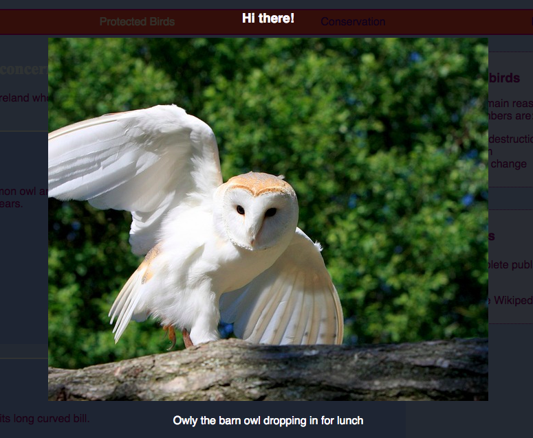

## Special effects

On this card you'll learn a few more nice effects that you can achieve with CSS.

### Shadows and movement

Let's add a little movement when you hover your cursor over the cards you made earlier.

+ Find the `.card:hover` CSS class from earlier and change it to the following:

```css
    .card:hover {
        box-shadow: 0px 2px 2px rgba(0,0,0,0.2); 
        transform: translateY(-2px);
    }
```
+ Try out different values in the `translate` function!

--- collapse ---
---
title: The `transform` property
---

If you completed the Intermediate HTML/CSS Sushi Cards, you may remember using the `transform` property in some `@keyframes` animations. Here you see that you can also use the property on its own within a regular CSS block.

One kind of value you can set it to is `rotate`, to make an element turn. Others are `translateY`, which moves something up or down, and `translateX`, for movement from side to side.

--- /collapse ---

+ Play about with different pixel values in the `box-shadow` property to see what they do.

--- collapse ---
---
title: What's `rgba`?
---

`rgba(0,0,0,0.2)` is another way of defining a colour.

It's got the usual three numbers (from `0` up to `255`) for red, green, and blue.

The fourth number, called the **alpha** value, defines how **transparent** (or see-through) something is. It is a decimal number between `0` and `1`, with `1` being not see-through at all, and `0` being completely invisible. This means the lower the alpha value of an element, the more see-through it is.

--- /collapse ---

+ Finally, make the movement smooth by adding the following property to the `.card` class from earlier:

```css
    transition: all 0.2s ease-out;
```

A duration of `0.2s` means the `transition` lasts for 0.2 seconds.

### Lightbox

Another effect you've probably seen on loads of websites is **lightbox**: you click on something and the website dims while something else, like a bigger picture or a popup box, appears in front of everything.



To get this effect you will make two links: one for the actual lightbox (the bit that pops up), and one for the thing that you click to make the lightbox appear. I'm going to do mine on the Attractions page of my website. You go with whatever page you have pictures on!

+ Decide what things you want to appear when you click, and add them all to your page in between a set of `a` tags to make a link. Make sure you give the link an `id`. The code can go anywhere on the page: you will be making the elements invisible in the next step!

```html
    <a href="#_" class="lightbox" id="boxBarnowl">
        <h3>Hi there!</h3>
        
        <p>Owly the barn owl dropping in for lunch</p>
    </a>
```

You can put anything you like in between the link tags. I've got a big picture, a heading, and some text. Maybe you just want a picture and no text!

+ Add the following CSS code for the lightbox. Can you work out what some of it does?
```css
    .lightbox{
        background: rgba(0,0,0,0.8);
        color: #ffffff;
        text-align: center;
        text-decoration: none;
        width: 100%;
        height: 100%;
        top: 0;
        left: 0;
        position: fixed;
        visibility: hidden;
        z-index: 999;
    }
```

Note: Setting the `position` property to `fixed` means the position you set will be relative to the browser window, so it will stay put when you scroll.

+ Next, decide what thing you want to click to make the lightbox appear, and add add a pair of `a` tags around that element (in my case it's a smaller picture of a lemur). The **target** of the link will be the lightbox, which you set using the `id`. You might recognise this technique from earlier!

```html
    <a href="#boxBarnowl">
        
    </a>
```

+ Finally add the following CSS code. Note that this is a **pseudo-class**; it should go after the code for the `.lightbox` class and not inside it!

```css
    .lightbox:target {
        visibility: visible;
    }
```

The `:target` pseudo-class gets applied whenever the lightbox was the target of the last link clicked. So when you click anywhere, the `visibility` will be set back to `hidden`.

+ Try clicking your new link to see the lightbox appear! To make it go away, just click anywhere on the page.

You can add as many lightboxes as you want to a page. They can all use the same CSS class — just make sure each one has a different `id`! For each one, you need to make something on your webpage into a link that you can click to make the lightbox appear, and then use the `id` as the `href` value in that link, just as you've done above!
